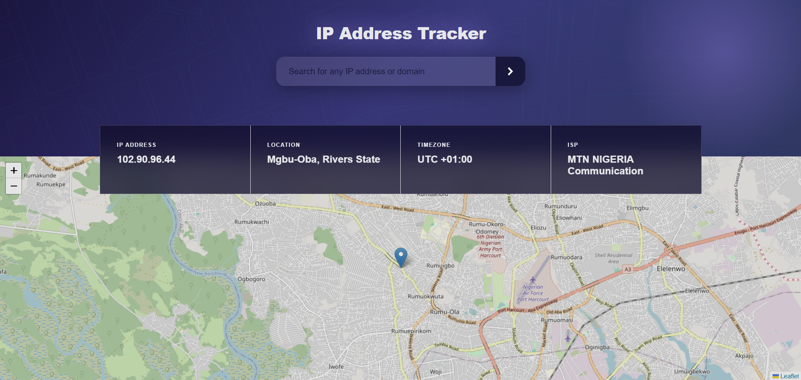

IP Address Tracker

## Welcome!

This is an interactive wep website that lets you look up for any IP address or domain name and display it on a live map.

## The Project

The goal was to build a fully functional IP tracker that feels clean and resposive. Users should be able to:

- See their own IP address location on load
- Search for any IP adsress
- View the **IP address, location, timezone and ISP** in an info card
- See the location oinned on an interactive map

## Built With

- HTML
- CSS
- Vanilla JavaScript
- Leaflet.js used for the interactive map
- IP Geolocation API by ipify used for IP lookup data

## How to Run

- Clone or download the project files
- Open `index.html` in your browser
- Your current IP location will load automatically
- Type any IP address in the search bar and hit the arrow button

## What I Learned

- Fecthing data from third party API using `fetch ()`
- Integrating Leaflet.js to display and update an interactive map

Have fun tracking!
